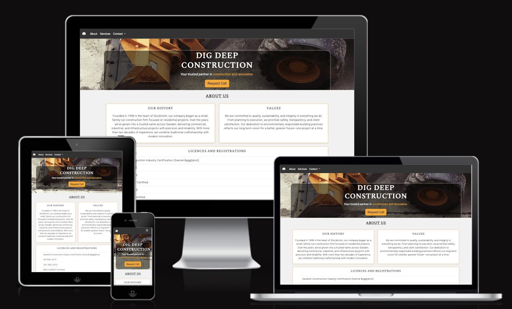

# Dig Deep Construction
Website Project - HTML, CSS

The website is a landing page for a construction company. The website's main purpose is to inform the readers about their services, history and accreditations. The wesbite also provides contact information and provides the user an opportunity to request for a phone call about a specific service. 



### Key Files
- **`index.html`**: The main HTML file containing the structure of the website.
- **`styles.css`**: Custom CSS file for additional styling.
- **`helmet-safety-solid.svg`**: Favicon for the website.

## How to Use
1. Clone the repository or download the project files.
2. Open `index.html` in a web browser to view the website.
3. Navigate through the sections using the navigation bar.
4. Submit a contact request using the form in the "Request Contact" section.

## Sections
### 1. **Header**
   - Displays the company name and tagline.
   - Includes a call-to-action button linking to the contact form.

### 2. **About Us**
   - Provides information about the company's history, values, and certifications.

### 3. **Services**
   - Highlights the company's key services with detailed descriptions.

### 4. **Contact**
   - A form for users to submit their name, email, phone number, service selection, and comments.
   - Includes a modal confirmation upon successful submission.

### 5. **Footer**
   - Displays contact details, operating hours, location, and social media links.

## Dependencies
- [Bootstrap 5](https://getbootstrap.com/)
- [Font Awesome](https://fontawesome.com/)

## Custom Scripts
The project includes a JavaScript snippet to handle form submission:
```javascript
document.getElementById('myForm').addEventListener('submit', function (event) {
  event.preventDefault(); // Prevent actual form submission

  // Show Bootstrap modal
  var myModal = new bootstrap.Modal(document.getElementById('submitModal'));
  myModal.show();
});
